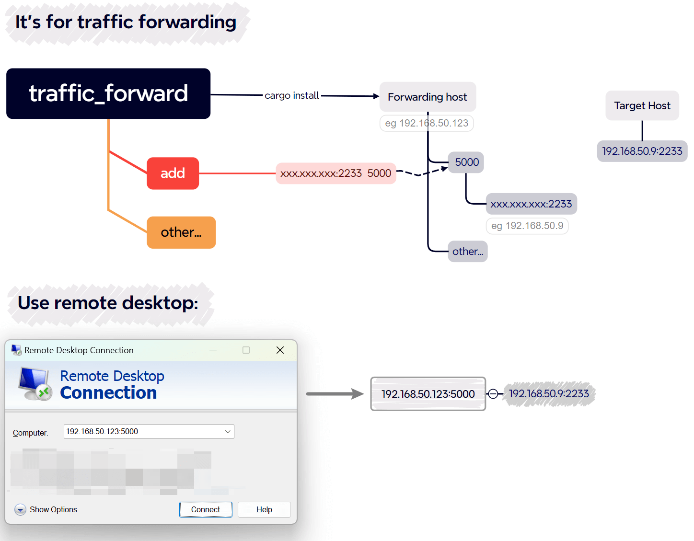

# Traffic Forwarding

> Traffic Forwarding

*Read this in other languages:  [中文](README.cn.md).*

# How does it work?



# Quick Start

## Prerequisite 
* Must be a Linux operating environment.
* The server has enabled traffic forwarding.【95% of people did not take this step】
* The server already has a `Rust` environment.

## illustrate

This tool only replaces writing `iptables` rules and solves multiple configurations with one command. As `iptables` is used, `root` account operations are required.

## Installation:


```bash
cargo install traffic_forward
```

Upon successful installation, you will see the following path:
```bash
...
 Compiling clap v4.5.4
   Compiling ron v0.8.1
   Compiling traffic_forward v0.1.0
    Finished release [optimized] target(s) in 2m 17s
  Installing /home/youre_account/.cargo/bin/traffic_forward
   Installed package `traffic_forward v0.1.0` (executable `traffic_forward`)
```

【Non-root Account】 Add a soft link to `/usr/bin`：

```
sudo ln -s /home/youre_account/.cargo/bin/traffic_forward /usr/bin/traffic_forward
```

View version:
``` bash
traffic_forward --version
traffic_forward 0.1.0
```

Or:
``` bash
sudo traffic_forward --version
traffic_forward 0.1.0
```

---

## Usage：

* Add forwarding：

```bash
# Use local port 5555 to forward to 192.102.11.44:8000
sudo traffic_forward add 192.102.11.44:8000 5555
```

* List of existing rules:
```
sudo traffic_forward list
0.0.0.0:5555 -> 192.102.11.44:8000
```

* Query traffic consumption for a specific IP:
```
sudo traffic_forward query 192.102.11.44
```

* Delete forwarding rule for a specific IP:
```bash
sudo traffic_forward delete 192.102.11.44
Delete completed
```

* Start the web API:
```bash
 sudo traffic_forward web
```

---


## Start web API

```bash
traffic_forward web
```

Add
* uri: iptables/add
* method: post
* request
```
{
	"target_ip": "192.168.50.50",
	"target_port": "4488",
	"local_port": "4433",
}
```

* response
```
{
	"code": 1,
	"msg": "Success",
	"data": null
}
```

Delete
* uri: iptables/del
* method: post
* request
```
{
	"target_ip": "192.168.50.50"
}
```

* response
```
{
	"code": 1,
	"msg": "Success",
	"data": null
}
```

List
* uri: iptables/list
* method: get
* request: empty (change next version will) 
* response
```
{
	"code": 1,
	"msg": "Success",
	"data": {
		"list": [
			{
				"ip": "192.168.50.50",
				"target_port": "4488",
				"local_port": "4433"
			}
		]
	}
}
```

# Use demo

``` bash
$ sudo traffic_forward -V
traffic_forward 0.1.2

$ sudo traffic_forward add 192.168.11.11:3389 2233
Add completed

$ sudo traffic_forward list
0.0.0.0:5000 -> 192.145.2.22:323
0.0.0.0:2233 -> 192.168.11.11:3389

$ sudo traffic_forward query 192.168.11.11
Up: 0 KB 
Down: 0 KB

$ sudo traffic_forward delete 192.168.11.11
Delete completed

$ sudo traffic_forward query 192.168.11.11
Query error: No matching IP found

$ sudo traffic_forward list
0.0.0.0:5000 -> 192.145.2.22:323

```